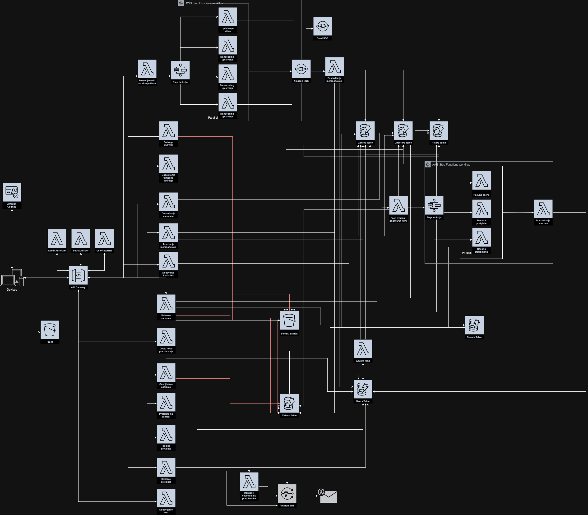

# Netflix on Cloud

## Project Overview

This project is a web application designed to store and manage movie content, developed using AWS cloud services and following cloud-native architecture principles.

## User Types

- **Unauthenticated User**: Can register and log into the system.
- **Administrator**: Authenticated user with the ability to upload, view, edit, and delete content.
- **Regular User**: Authenticated user who can search, view, rate, subscribe to content, manage subscriptions, receive notifications, have a personalized feed, and download content.

## System Components

- **Client Application**: Provides a graphical interface for users to access system functionalities.
- **Server Application**: A cloud-native application containing the business logic of the system, leveraging AWS services to meet functional and non-functional requirements.

## Functional Requirements

1. **User Registration**: Unauthenticated users can register by providing necessary details.
2. **User Login**: Unauthenticated users can log in using their credentials.
3. **Content Upload (Admin)**: Administrators can upload movie content along with metadata (file name, type, size, creation and modification time, title, description, actors, directors, genres).
4. **Content Viewing**: Both administrators and regular users can view content and metadata.
5. **Content Editing (Admin)**: Administrators can edit movie content and metadata.
6. **Content Deletion (Admin)**: Administrators can delete movie content and associated metadata.
7. **Content Search**: Regular users can search content based on metadata.
8. **Content Download**: Regular users can download movie content.
9. **Content Rating**: Regular users can rate content.
10. **Content Subscription**: Regular users can subscribe to content based on actors, directors, genres, etc.
11. **Subscription Management**: Regular users can manage their subscriptions.
12. **Personalized Feed**: Regular users get a personalized feed based on previous interactions.
13. **Content Transcoding**: Users can choose the resolution for viewing or downloading content, with automatic processing and storage of different resolutions.

## Non-Functional Requirements

1. **Cloud-Native Architecture**: The system follows cloud-native architecture using appropriate AWS services.
2. **Separate Storage for Content and Metadata**: Content and metadata are stored separately in appropriate storage solutions.
3. **Performance**: Ensuring efficient performance during content search and retrieval.
4. **Infrastructure as Code (IaC)**: All services are instantiated and configured using IaC tools.
5. **Communication Style**: Appropriate use of synchronous and asynchronous communication, following event-driven architecture principles.
6. **API Gateway**: Serves as the entry point for the system, offering REST APIs for communication.
7. **Frontend Deployment**: The frontend application is publicly accessible and interacts with the backend services.
8. **Notification System**: Users receive notifications when new content matching their subscriptions is available.

## AWS Services Used

- **AWS Lambda**: For serverless execution of business logic.
- **AWS Step Functions**: To coordinate distributed components and handle workflows.
- **Amazon SNS (Simple Notification Service)**: For sending notifications to users.
- **Amazon SQS (Simple Queue Service)**: For asynchronous communication between system components.
- **Amazon DynamoDB**: For storing metadata and user data.
- **Amazon S3 (Simple Storage Service)**: For storing movie content and serving static assets for the Angular frontend.
- **AWS API Gateway**: For creating, publishing, maintaining, monitoring, and securing APIs.

## Deployment

- **Frontend Application**: Deployed using AWS S3 bucket, ensuring it is publicly accessible and interacting seamlessly with the backend services.

## Architecture Diagram

## Getting Started

To get started with the project, follow the instructions below:

1. **Clone the Repository**: `git clone https://github.com/Olivera2708/Netflix-cloud`
2. **Install Dependencies**: Navigate to the project directory and run `npm install` for the frontend and `pip install -r requirements.txt` for the backend.
3. **Deploy the Infrastructure**: Use the provided IaC scripts to deploy the necessary AWS resources.
4. **Run the Application**: Start the frontend application and ensure it connects to the deployed backend services.
